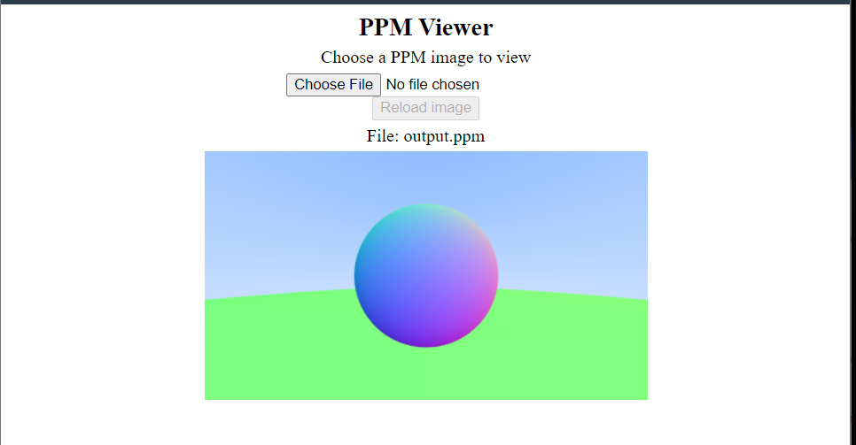
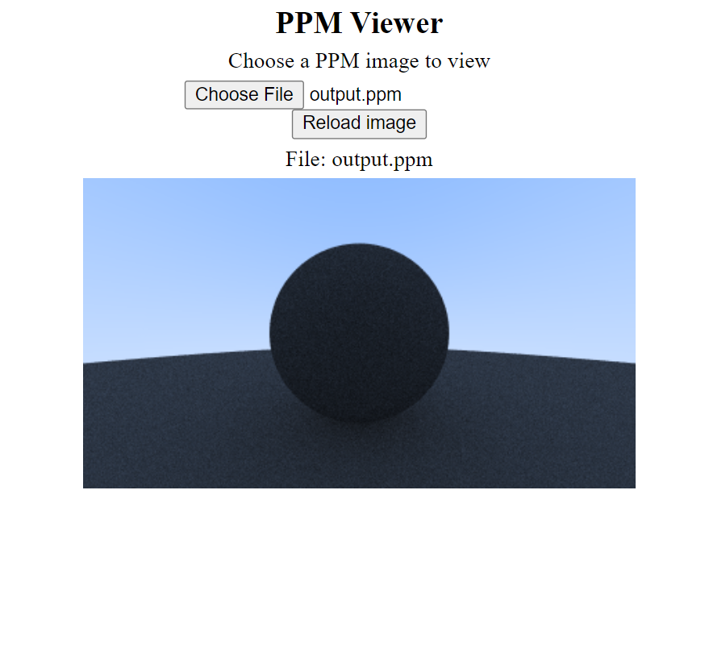

This a simple rendering program written completely in the java language, the rendering is done with the ray tracing technique and the output can be viewed through output.ppm . This project has been inspired by the ray tracing in one week book which is written in c++. the rendrer currently supports anti-aliasing and diffusion. In the future features like multiple material rendering , and advanced features will be added

## Folder Structure

The workspace contains two folders by default, where:

- `src`: the folder to maintain sources
- `lib`: the folder to maintain dependencies

Meanwhile, the compiled output files will be generated in the `bin` folder by default.

 